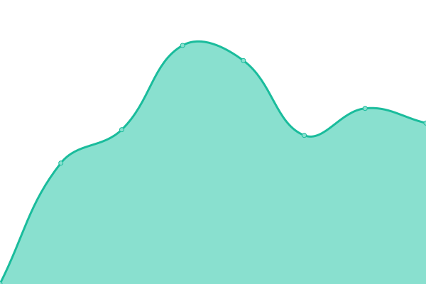
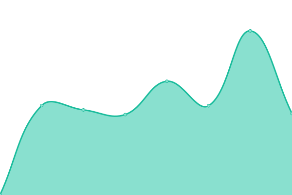

# [📈 Live Status](https://Stunkymonkey.github.io/upptime-checks): <!--live status--> **🟩 All systems operational**

This repository contains the open-source uptime monitor and status page for [Felix Bühler](https://stunkymonkey.de), powered by [Upptime](https://github.com/upptime/upptime).

With [Upptime](https://upptime.js.org), you can get your own unlimited and free uptime monitor and status page, powered entirely by a GitHub repository. We use [Issues](https://github.com/Stunkymonkey/upptime-checks/issues) as incident reports, [Actions](https://github.com/Stunkymonkey/upptime-checks/actions) as uptime monitors, and [Pages](https://Stunkymonkey.github.io/upptime-checks) for the status page.

<!--start: status pages-->
<!-- This summary is generated by Upptime (https://github.com/upptime/upptime) -->
<!-- Do not edit this manually, your changes will be overwritten -->
<!-- prettier-ignore -->
| URL | Status | History | Response Time | Uptime |
| --- | ------ | ------- | ------------- | ------ |
|  [Newton](https://buehler.rocks/) | 🟩 Up | [newton.yml](https://github.com/Stunkymonkey/upptime-checks/commits/HEAD/history/newton.yml) | 

 501ms
     
 | 

<a href="https://Stunkymonkey.github.io/upptime-checks/history/newton">100.00%</a>
    

|  [Uberspace](https://stunkymonkey.de/) | 🟩 Up | [uberspace.yml](https://github.com/Stunkymonkey/upptime-checks/commits/HEAD/history/uberspace.yml) | 

 614ms
     
 | 

<a href="https://Stunkymonkey.github.io/upptime-checks/history/uberspace">100.00%</a>
    

|  [Amani-Kinderdorf](https://www.amani-kinderdorf.de/) | 🟩 Up | [amani-kinderdorf.yml](https://github.com/Stunkymonkey/upptime-checks/commits/HEAD/history/amani-kinderdorf.yml) | 

 2327ms
     
 | 

<a href="https://Stunkymonkey.github.io/upptime-checks/history/amani-kinderdorf">98.52%</a>
    

<!--end: status pages-->

[**Visit our status website →**](https://Stunkymonkey.github.io/upptime-checks)

## 📄 License

- Powered by: [Upptime](https://github.com/upptime/upptime)
- Code: [MIT](./LICENSE) © [Felix Bühler](https://stunkymonkey.de)
- Data in the `./history` directory: [Open Database License](https://opendatacommons.org/licenses/odbl/1-0/)
